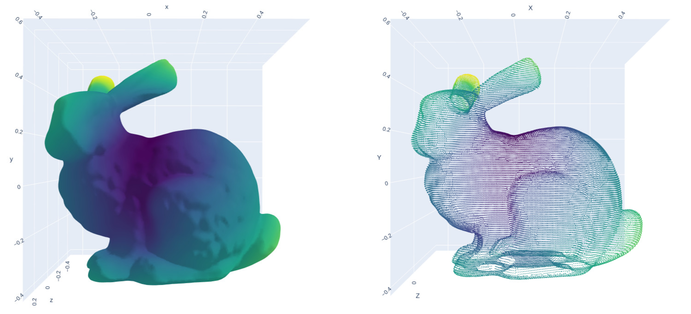

# Denoise and Deform 3D Point Clouds in Python With Graph Laplacians

A **point cloud** is a set of data points in a 3D coordinate system, where each point represents a single spatial measurement on some object's surface, forming together the external surface of an object in space. 
Point cloud data can be generated by 3D laser scanners (LiDAR) or photogrammetry and are often used to create precise digital 3D representations used in construction, engineering, and manufacturing.

We often want to analyse local geometric properties of surfaces — how they bend, change slope, or vary in density. This is essential for creating realistic graphics, analyzing 3D scans, and optimizing shapes for engineering and the mathematical device for achieving this goal is computation of derivatives on such 3D objects. 

The key difference between point clouds and 3D meshes is that point clouds are unconnected data points, rather than a surface constructed from triangles or polygons (Figure 1).

<figure>
  
  <figcaption>Figure 1: The stanford bunny 3D models: mesh (left) and pointcloud (right)</figcaption>
</figure>


Unlike mesh models, point clouds lack explicit connectivity information (edges and faces), making it difficult to compute derivatives on them [1]. A major challenge is to extract global information from the given point clouds due to the lack of connectivity. The graph Laplacian solves this by defining connectivity based on neighborhood graphs (e.g., $k$-nearest neighbors) and constructing a discrete operator that approximates continuous geometric properties, such as curvature or surface normal, on the discrete data. 

The applications of the graph Laplacian are numerous  - from LiDAR-based SLAM & navigation for umanned vehicles to surface reconstruction and mesh generation for hole-filling and repairing 3D scans.


In this tutorial we will compute one of the versios of the graph Laplacian and use it for smoothing and transforming one point cloud shape to another. 

### Tutorial structure

```python
pointcloud_laplacian (root)/
├── 📁 assets/
├── 📁 data/
│   ├── 📄 bunny.ply
│   └── 📄 dragon.ply
├── 📁 tests/
│   └── 📄 tests.py
├── 📄 pointcloud_laplacian.ipynb
├── 📄 laplacian.py
├── 📄 requirements.txt
└── 📄 README.md
```
### Tutorial outline

* What you will build
* Point clouds and kNN graphs: from kNN to sparse adjacency
* Graph Laplacian computation
* Stable smoothing + simple nearest neighbor pull (explicit solve)
* Deformation visualization
* Testing your code
